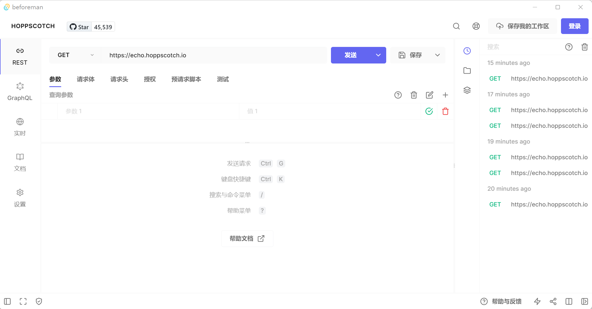

# Affine Client

beforeman is a client for [hoppscotch](https://github.com/hoppscotch/hoppscotch.git) based on [Tauri](https://tauri.app/)

## Supported Platforms

- Windows
- Linux
- MacOS

## Download

`https://github.com/qihaiyan/beforeman/releases`

## Build

### System Requirements

- [Rust & Cargo](https://www.rust-lang.org/)
- [pnpm](https://pnpm.io/)
- [yarn](https://yarnpkg.com/)

### How to build

1. install system requirements
2. git clone this repo (including submodule): git clone --recurse-submodules https://github.com/qihaiyan/beforeman.git
3. cd beforeman
4. yarn
5. git submodule update --init --recursive
6. cd ./hoppscotch
7. pnpm i
8. pnpm run generate
9. cd ../tauri
10. cargo install --path .
11. cd ..
12. yarn run build:client

Navigate to `beforeman/tauri/target/release/bundle/` for target file

> It may fail when bundling, just retry

### Screenshot

## Limitations

This client is only a wrapper without any native api intergration for now.

## TODO

- [x] add build pipeline
- [ ] speed up build
